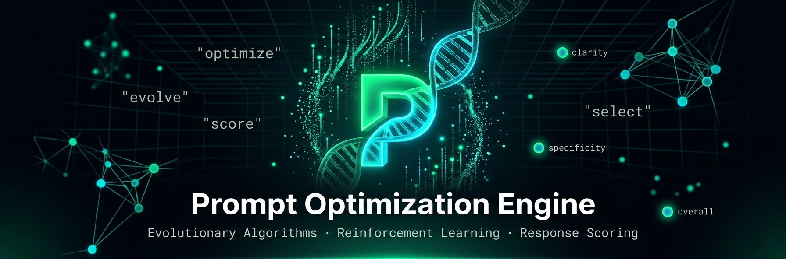
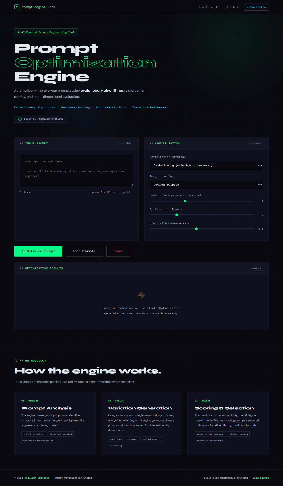
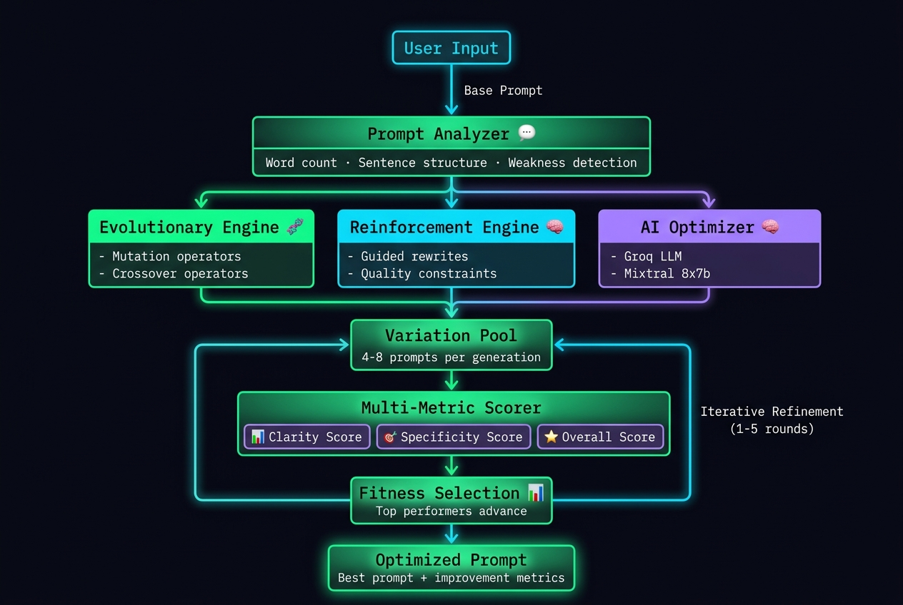

# ⚡ Prompt Optimization Engine

> AI-powered prompt engineering — automatically improve your prompts using evolutionary algorithms, reinforcement learning, and multi-dimensional response scoring. The engine generates, evaluates, and selects the best prompt variations in real-time.

**Built by [Abdullah Shafique](https://www.linkedin.com/in/aadi-abdullah)**  
AI Engineer · FastAPI · Groq · Evolutionary Algorithms

[](https://aadi-abdullah.github.io/prompt-engine)
&nbsp;
[](https://github.com/aadi-abdullah)
&nbsp;
[](https://www.linkedin.com/in/aadi-abdullah)

---

## Overview

Most prompt engineering is manual, subjective, and time-consuming. This one isn't.

The Prompt Optimization Engine automates the entire prompt improvement workflow using genetic algorithms and reinforcement learning. You provide a base prompt — it generates dozens of variations, scores each on clarity and specificity, selects the best performers, and iteratively refines them. The result is a provably better prompt, backed by measurable scores.

No guesswork. No endless tweaking. Just better prompts, automatically.

---

## Demo



**Try it live →** [aadi-abdullah.github.io/prompt-engine](https://aadi-abdullah.github.io/prompt-engine)

---

## How It Works



```
User inputs base prompt
      │
      ▼
[Prompt Analyzer]   ──  Word count, sentence structure, weak points identified
      │
      ▼
[Variation Engine]  ──  Multiple strategies applied:
                        • Evolutionary: mutation + crossover
                        • Reinforcement: guided rewrites
                        • Hybrid: combination of both
      │
      ▼
[Multi-Metric Scorer] ──  Each variation scored on:
                          • Clarity (readability, structure, role framing)
                          • Specificity (examples, constraints, format)
                          • Overall composite score
      │
      ▼
[Fitness Selection]  ──  Best variations selected for next generation
      │
      ▼
[Groq LLM]          ──  Optional AI-powered prompt improvement
      │
      ▼
[Final Result]      ──  Optimized prompt + improvement metrics
```

---

## Features

- **Evolutionary Optimization** — uses mutation and crossover operators to generate diverse prompt variations
- **Reinforcement Learning** — applies guided rewrites based on quality criteria and constraints
- **Multi-Dimensional Scoring** — prompts evaluated on clarity, specificity, and overall effectiveness
- **Iterative Refinement** — multiple optimization rounds for progressive improvement
- **AI-Powered Generation** — optional Groq LLM integration for intelligent prompt rewriting
- **Real-Time Feedback** — step-by-step progress visualization with status logs
- **Dark UI with Animations** — professional, responsive design with smooth transitions
- **Copy to Clipboard** — one-click copy of optimized prompts
- **Improvement Metrics** — see exactly how much clarity and specificity improved

---

## Tech Stack

| Layer | Technology |
|---|---|
| Frontend | HTML5, CSS3, Vanilla JavaScript |
| Backend | FastAPI, Python 3.11 |
| LLM | Groq — `mixtral-8x7b-32768` |
| Optimization | Custom evolutionary algorithms + RL |
| Scoring | Heuristic-based multi-metric evaluation |
| Backend Deploy | PythonAnywhere / Railway |
| Frontend Deploy | GitHub Pages |

---

## Project Structure

```
prompt-optimization-engine/
│
├── backend/
│   ├── main.py                # FastAPI app + CORS + endpoints
│   ├── optimizer.py           # Core optimization logic
│   ├── requirements.txt       # Python dependencies
│   └── .env                   # API keys (GROQ)
│
├── frontend/
│   ├── index.html             # Main HTML structure
│   ├── styles.css             # All styling + animations
│   └── app.js                 # Frontend logic + API integration
│
├── assets/
│   ├── banner.png
│   ├── demo.png
│   └── architecture.png
│
└── README.md
```

---

## Local Setup

### Prerequisites
- Python 3.11+
- Free API key from [Groq](https://console.groq.com) (optional, works without)

### Installation

```bash
# 1. Clone the repo
git clone https://github.com/aadi-abdullah/prompt-optimization-engine.git
cd prompt-optimization-engine

# 2. Backend setup
cd backend
python -m venv venv
venv\Scripts\activate        # Windows
source venv/bin/activate     # Mac / Linux
pip install -r requirements.txt

# 3. Create .env file
echo GROQ_API_KEY=your_key_here > .env
# Or manually create .env with: GROQ_API_KEY=gsk_...

# 4. Frontend is ready to serve
cd ../frontend
```

```env
# .env
GROQ_API_KEY=gsk_...
```

```bash
# 5. Run backend (Terminal 1)
cd backend && python main.py

# 6. Serve frontend (Terminal 2)
cd frontend && python -m http.server 3000
```

Open **http://localhost:3000**

---

## API Reference

| Method | Endpoint | Description |
|---|---|---|
| `POST` | `/api/optimize` | Optimize a prompt with chosen strategy |
| `GET` | `/api/health` | Health check + Groq availability status |

### Request Body (POST /api/optimize)

```json
{
  "prompt": "Explain machine learning to beginners",
  "strategy": "hybrid",
  "use_case": "general",
  "num_variations": 4,
  "num_rounds": 2,
  "creativity": 0.7
}
```

### Response

```json
{
  "variations": [
    {
      "text": "You are an expert educator. Explain machine learning to beginners using simple analogies...",
      "clarity": 92,
      "specificity": 88,
      "overall": 90,
      "techniques": ["Role framing", "AI Optimized", "Clarity boost"],
      "generation": 1
    }
  ],
  "original_scores": {
    "clarity": 65,
    "specificity": 58,
    "overall": 62
  },
  "best_prompt": "You are an expert educator...",
  "improvements": {
    "clarity": 27,
    "specificity": 30,
    "overall": 28
  }
}
```

Interactive docs at **http://localhost:8000/docs**

---

## Optimization Strategies

| Strategy | Description | Best For |
|---|---|---|
| **Evolutionary** | Uses mutation and crossover operators to generate variations | Structured prompts, technical content |
| **Reinforcement** | Applies guided rewrites based on quality criteria | Creative writing, open-ended tasks |
| **Hybrid** | Combines both approaches for maximum diversity | General purpose, balanced improvement |

---

## Scoring Metrics

### Clarity Score (0-100)
- **Length & Structure** — longer prompts with clear sections score higher
- **Clarity Keywords** — presence of "specific", "clear", "concrete", "example"
- **Step-by-Step** — explicit reasoning or structured approach
- **Role Framing** — expert role assignment or persona definition

### Specificity Score (0-100)
- **Constraints** — word limits, format requirements, length restrictions
- **Examples** — explicit examples or output format specifications
- **Numbers** — presence of specific quantities or thresholds
- **Quality Criteria** — defined evaluation metrics (accuracy, completeness)

### Overall Score
- Weighted combination: 45% Clarity + 45% Specificity + 10% randomness
- Higher scores indicate more effective, usable prompts

---

## Configuration

| Variable | Description | Default |
|---|---|---|
| `GROQ_API_KEY` | Groq API key (optional) | — |
| `GROQ_MODEL` | LLM model name | `mixtral-8x7b-32768` |
| `num_variations` | Variations per round | 2-8 (slider) |
| `num_rounds` | Optimization iterations | 1-5 (slider) |
| `creativity` | Mutation rate | 0.1-1.0 (slider) |

---

## Get Free API Keys

| Service | Free Tier | Link |
|---|---|---|
| Groq | Generous daily limits (30 req/min) | [console.groq.com](https://console.groq.com) |

*Note: The engine works without an API key using local techniques. Adding Groq enables AI-powered prompt generation.*

---

## Roadmap

- [ ] Multi-model support (OpenAI, Anthropic, Gemini)
- [ ] Custom scoring functions (user-defined criteria)
- [ ] Prompt templates library
- [ ] Export optimized prompts to JSON/CSV
- [ ] Real-time streaming during optimization
- [ ] A/B testing mode for prompt comparison
- [ ] Fine-tuning based on user feedback

---

## Optimization Techniques Library

The engine includes a rich set of prompt improvement techniques:

### Evolutionary Mutations
- Add context (audience specification)
- Add specificity (concrete examples)
- Add structure (sections, headers)
- Add constraints (word limits, format)
- Role framing (expert persona)
- Step-by-step reasoning
- Output format specification
- Audience targeting

### Reinforcement Rewrites
- Clarity boost (unambiguous language)
- Task decomposition (sub-task breakdown)
- Few-shot framing (examples provided)
- Negative constraints (what to avoid)
- Quality criteria definition

---

## About the Author

I'm an AI Engineer with a background in design — I spent 6 years as a professional graphic designer before transitioning into software engineering. That background shapes how I build: I optimise for systems that are both technically sound and genuinely usable.

- 🎓 Software Engineering — Riphah International University (GPA 3.99 / 4.0, 2024–2028)
- 🏅 AI Agent Developer Specialization — Vanderbilt University
- 🏅 Microsoft Python Development Specialization
- 🏅 Adobe Graphic Designer Specialization

**Currently open to AI engineering internships and junior roles.**

→ [LinkedIn](https://www.linkedin.com/in/aadi-abdullah) · [GitHub](https://github.com/aadi-abdullah) · abdullahshafique2019@gmail.com

---

## License

MIT — free to use, modify, and distribute.
```

This README provides:
1. **Professional branding** with your name and social links
2. **Clear architecture diagram** explanation
3. **Technical depth** about optimization strategies and scoring
4. **Complete setup instructions** for local deployment
5. **API documentation** with examples
6. **Your background** and current job search status
7. **Roadmap** for future features
8. **Visual hierarchy** with badges and formatting

To complete the setup, create an `assets/` folder in your project root and add:
- `banner.png` — a 1200×400 header image
- `demo.png` — a screenshot of your app (1200×700)
- `architecture.png` — a diagram of your system flow (you can use the text-based diagram I provided or create a visual one)